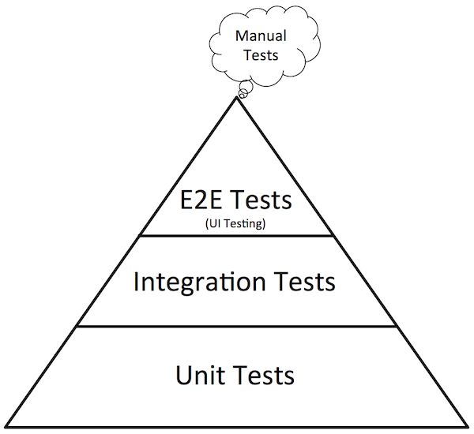

## Introduction

->-

### Catégories de Tests

Différentes catégories existent :

* Tests Unitaires
* Tests d'intégration
* Tests fonctionnels
* Tests de performance
* Tests de vulnérabilités
* Tests de robustesse
* Tests d'installation ou déploiement...

->-

### Tests Unitaires

* Testent une méthode d'une classe en isolation
* Exécutés lors d'un  `mvn test`
* Doivent fonctionner sur un poste déconnecté du réseau
* Outils : JUnit, Mockito

->-

### Tests d'intégration

* Testent un ensemble de composants
* Exemples
  * Web Services SOAP ou REST
  * Services métier s'appuyant sur DAO Hibernate
* Outils : Junit, SoapUI

->-

### Tests fonctionnels

* Exécutent des scénarios fonctionnels en simulant les interactions de l'utilisateur
* On parle aussi de tests d'acceptance
* Outils : Selenium, HP, UFT, CasperJS, Cucumber

->-

### Tests de performance

* Simulent la charge utilisateur sur un environnement iso-production
* Outils : JMeter, Gatling, Dynatrace...

->-

### Test de vulnérabilités

* Recherchent de failles de sécurités
  * dans les librairies utilisées
  * dans la structure du code
* Généralement manuellement
* Site de l'OWASP

->-

### Tests de robustesse

* Evalue la stabilité de l'application
* Evalue selon deux critères :
  * Charge maximale
  * Stabilité dans le temps
* Outils : JMeter, Gatling

->-

### Test de déploiement

* Vérifie le bon déploiement de l'application
* Fait lors des mises en recette ou pré-production

->-

### Le System Under Test

* Aussi appelé SUT
* Défini les frontières de ce que vous testez
 * Une simple méthode
 * Une fonctionnalité

->-

### Les tests et le développement

* Les tests font partie du travail du développeur
* Souvent une variables d'ajustement
* Quand faire les tests ?
 * Tests après le développement
 * Test Driven Development (TDD)

->-

 ### Bug et coût

->-

 ### Pyramide de tests

 Pyramide de Mike Cohn

